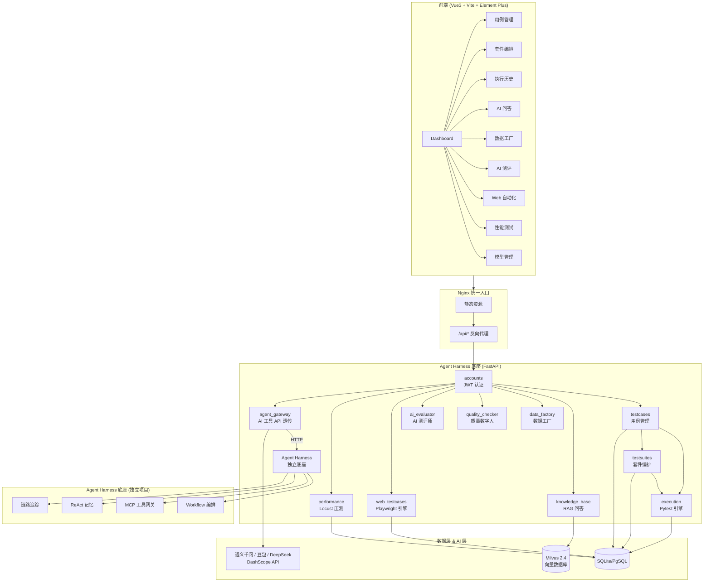
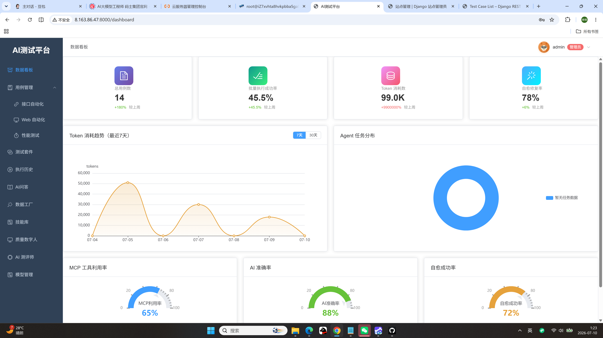
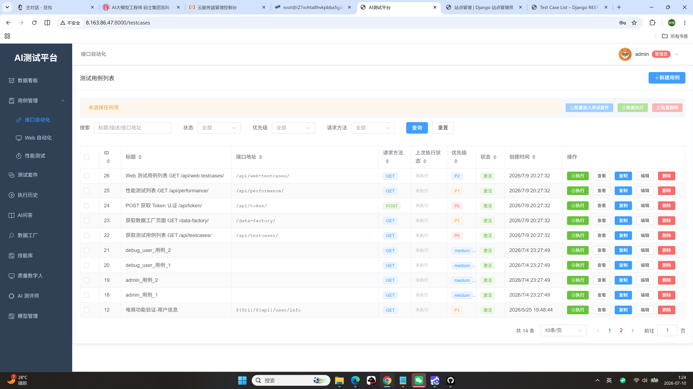

# AutoTestHub — AI 驱动的全链路测试平台

<p align="center">
  
  
  
  
  
</p>

<p align="center">
  <b>面向全链路测试的 AI 增强平台</b> — 接口自动化 + Web UI 自动化 + 性能压测 + AI 智能评测，四位一体
</p>

<p align="center">
  <a href="#快速开始">快速开始</a> •
  <a href="#功能矩阵">功能矩阵</a> •
  <a href="#技术架构">技术架构</a> •
  <a href="#演示截图">演示截图</a> •
  <a href="ARCHITECTURE.md">架构文档</a>
</p>

---

## 一句话介绍

> **AutoTestHub** 将 AI 大模型能力深度注入测试全链路：接口文档一键解析生成测试用例，Web 页面 AI 感知自动编写用例，性能压测自动编排负载，AI 评测引擎自动评估回答质量。用例编写效率提升 **80%**，测试覆盖构建周期从周级缩短至小时级。

---

## 功能矩阵

### 一、接口自动化测试

| 功能 | 说明 | 技术亮点 |
|------|------|----------|
| **AI 用例生成** | 上传 Swagger/OpenAPI/Word 接口文档 → AI 解析 → 自动生成结构化测试用例 + 断言规则 | 通义千问 + 结构化 Prompt 工程 |
| **接口串联编排** | 通过 `extract_rules` + `context_vars` 实现多接口变量传递与依赖管理 | 上下文链式注入，支持复杂业务流 |
| **多格式报告** | PDF（reportlab）、HTML、Allure 三种报告格式 + 在线预览 | Allure 动态生成，支持趋势分析 |
| **执行引擎** | 动态生成 Pytest 脚本，subprocess 隔离执行，支持批量/单条/调试三种模式 | 沙箱执行 + 实时日志流式返回 |

### 二、Web UI 自动化测试

| 功能 | 说明 | 技术亮点 |
|------|------|----------|
| **Playwright 双引擎** | 原生 Playwright + Midscene AI 感知引擎，支持传统脚本和 AI 语义驱动 | 双模式切换，无代码/有代码并存 |
| **AI 视觉理解** | 上传页面截图 → AI 识别交互元素 → 自动生成 Playwright 操作链 | 通义千问 VL 多模态理解 |
| **自愈执行** | 元素定位失败时，AI 自动识别页面变化并修正定位策略 | 智能元素重定位 + 截图比对 |
| **执行监控** | 实时截图回传、操作链可视化、失败自动回溯 | WebSocket 实时推送 |

### 三、性能测试

| 功能 | 说明 | 技术亮点 |
|------|------|----------|
| **Locust 压测引擎** | 基于 Locust 的分布式负载生成，支持 RPS/并发/阶梯模式 | 动态脚本生成，无需手写 Locustfile |
| **性能用例管理** | 独立的性能测试用例库，与接口用例复用请求定义 | 同一接口 = 功能测试 + 性能测试 |
| **实时指标** | QPS、P50/P95/P99 延迟、错误率、吞吐量实时监控 | 执行中实时数据聚合 |
| **报告分析** | 性能瓶颈自动分析、对比报告、趋势图 | 基于历史数据的趋势对比 |

### 四、AI 测评与质量保障

| 功能 | 说明 | 技术亮点 |
|------|------|----------|
| **RAG 知识库** | 文档上传 → 分块 → Milvus 向量存储 → 语义检索问答 | Milvus 2.4 + DashScope Embedding，支持亿级向量 |
| **AI 测评师** | 批量提问 → AI 评估正确性/完整性 → 安全检测 → 生成评测报告 | 5 类问题覆盖 + 4 维度安全检测 |
| **质量数字人** | 用例质量三维度打分（完整性 40 + 格式规范 20 + 内容质量 40） | 规则引擎 + LLM 评估双校验 |
| **多模型管理** | 支持通义千问、豆包、DeepSeek 等多模型配置与切换 | 统一 Agent Gateway 抽象层 |

### 五、数据工厂与生态

| 功能 | 说明 |
|------|------|
| **智能造数** | Faker 规则造数 + AI 智能生成，支持订单/用户/物流/售后等业务模板 |
| **数据集版本** | 版本快照 + 引用追踪，支持回滚与对比 |
| **MCP 工具** | 支持 Model Context Protocol 扩展，可接入外部工具链 |
| **定时调度** | 基于 APScheduler 的定时任务调度，支持 Cron 表达式 |

---

> **项目分层说明**：Agent Harness（AI 编排底座）与 AI 测试平台在同一仓库内，分别为 `agent-harness/` 和 `backend/` + `frontend/`，通过标准 HTTP API 解耦。

## 技术架构



### 核心设计决策

| 决策 | 说明 |
|------|------|
| **Nginx 统一入口** | 前端静态资源 + API 反向代理，避免 CORS 跨域问题 |
| **JWT 双 Token** | Access Token 24h + Refresh Token 7d，无状态认证 |
| **Agent Gateway** | 统一 AI 调用层，支持多模型热切换与熔断降级 |
| **Milvus 向量存储** | 企业级向量数据库，支持 AUTOINDEX/HNSW，亿级向量高并发 |
| **Pytest 动态生成** | 用例数据 → Jinja2 模板 → Pytest 脚本 → 沙箱执行 |
| **Playwright + Midscene** | 双引擎：传统定位 + AI 语义感知，覆盖全场景 |

---

## 技术栈

| 层级 | 技术 | 说明 |
|------|------|------|
| **后端框架** | FastAPI + Pydantic | REST API + JWT 认证 |
| **数据库** | SQLite / PostgreSQL | 开发/生产切换，环境变量配置 |
| **向量数据库** | Milvus 2.4 | 企业级向量存储，支持亿级向量 |
| **AI 引擎** | DashScope (通义千问/豆包/DeepSeek) | 多模型统一调用，支持 VL 多模态 |
| **Web 自动化** | Playwright + Midscene | 双引擎：原生脚本 + AI 语义驱动 |
| **性能测试** | Locust | 分布式负载生成，实时指标采集 |
| **测试引擎** | Pytest + Allure | 动态脚本生成，多格式报告 |
| **前端** | Vue3 + Vite + Element Plus | 21 个功能页面，SPA 应用 |
| **部署** | Docker + Nginx + Gunicorn | 容器化部署，一键启动 |
| **任务调度** | APScheduler | 定时任务 + Cron 表达式 |

---

## 快速开始

> **注意**：如需使用 AI 编排能力（工作流/MCP/记忆），请同时启动 `agent-harness/` 目录下的底座服务。

### 方式一：Docker Compose（推荐）

```bash
# 1. 克隆项目
https://github.com/jiguenhuang0-ai1y/AutoTestHub.git

# 2. 配置环境变量
cp backend/.env.example backend/.env
# 编辑 backend/.env，填入 DASHSCOPE_API_KEY

# 3. 一键启动（仅业务平台）
docker compose up -d

# 4. 访问
# 前端: http://localhost
# 后端API: http://localhost:8000/api/
# 默认账号: admin / admin123456
# 独立底座: http://localhost:81
```

### 启动 Agent Harness 底座（独立项目）

```bash
# 在同一仓库中启动底座
cd agent-harness
cp .env.example .env
# 编辑 .env，填入 DEEPSEEK_API_KEY 和 SERVICE_TOKEN
docker compose up -d

# 底座前端：http://localhost:81
# 底座后端：http://localhost:8001
```

### 方式二：本地开发

```bash
# 后端（仅业务平台）
cd backend
pip install -r requirements.txt
# 创建默认管理员（admin / admin123456）
python manage.py shell -c "from django.contrib.auth import get_user_model; U=get_user_model(); U.objects.filter(username='admin').exists() or U.objects.create_superuser('admin', 'admin@example.com', 'admin123456')"

# 前端（仅业务平台）
cd ../frontend
npm install
npm run dev

# 访问：http://localhost:5173
```
python manage.py runserver

# 前端
cd frontend
npm install
npm run dev
```

---

## 演示截图

> 以下为系统关键页面截图，展示完整的测试平台能力

| Dashboard | 用例管理 | AI 用例生成 |
|:---------:|:--------:|:-----------:|
|  |  |  |

| 执行详情 | 知识库问答 | AI 测评 |
|:--------:|:----------:|:-------:|
|  |  |  |

| Web 自动化 | 性能测试 | 模型管理 |
|:----------:|:--------:|:--------:|
|  |  |  |

---

## 项目结构

```
AutoTestHub/
├── agent-harness/               # Agent Harness 单服务（FastAPI 底座 + Vue 中台）
│   ├── accounts/              # JWT 用户认证
│   ├── testcases/             # 接口测试用例 + AI 生成
│   ├── testsuites/            # 测试套件编排
│   ├── execution/             # Pytest 执行引擎 + Allure 报告
│   ├── web_testcases/         # Web UI 自动化（Playwright + Midscene）
│   ├── performance/           # 性能测试（Locust 压测）
│   ├── knowledge_base/        # RAG 知识库（Milvus + DashScope）
│   ├── data_factory/          # 数据工厂（Faker + AI 造数）
│   ├── quality_checker/       # 质量数字人（三维度评分）
│   ├── ai_evaluator/          # AI 测评师（5 类问题 + 4 维安全）
│   ├── agent_gateway/         # 统一 AI 入口（多模型管理）
│   ├── core/                  # 核心工具（Milvus 存储、DashScope 客户端）
├── frontend/                   # Vue3 前端（21 个页面）
│   └── src/views/
│       ├── Login.vue
│       ├── Dashboard.vue
│       ├── TestCaseList.vue / AIGenerate.vue
│       ├── TestSuiteList.vue
│       ├── ExecutionDetail.vue / ExecutionHistory.vue
│       ├── KnowledgeChat.vue
│       ├── DataFactory.vue
│       ├── AIEvaluator.vue / QualityChecker.vue
│       ├── WebTestCaseList.vue / WebExecutionDetail.vue
│       ├── PerfTestCaseList.vue / PerfExecutionDetail.vue
│       ├── ModelManage.vue / MCPTools.vue
│       ├── SelfHealingMonitor.vue / WorkflowMonitor.vue
│       └── AgentSkills.vue / ReportView.vue
├── docker-compose.yml          # 一键部署
├── .github/workflows/          # CI/CD 配置
└── docs/                       # 文档与截图
```

---

## 已完成功能（非 TODO）

- [x] AI 用例生成（通义千问解析接口文档）
- [x] 接口串联编排（extract_rules + context_vars）
- [x] Pytest 动态执行引擎 + Allure 报告
- [x] Web UI 自动化（Playwright + Midscene AI 双引擎）
- [x] 性能测试（Locust 压测引擎 + 实时指标）
- [x] RAG 知识库（Milvus 2.4 + DashScope Embedding）
- [x] AI 测评师（5 类问题 + 4 维安全检测）
- [x] 质量数字人（三维度评分引擎）
- [x] 数据工厂（Faker + AI 造数 + 版本管理）
- [x] 多模型管理（通义千问/豆包/DeepSeek 切换）
- [x] 定时任务调度（APScheduler）
- [x] MCP 工具扩展
- [x] Docker Compose 一键部署
- [x] 21 个前端功能页面

---

## 性能指标

| 指标 | 数值 | 说明 |
|------|------|------|
| 用例生成效率 | 提升 80% | 接口文档 → 结构化用例，10 分钟 vs 1 小时 |
| 向量检索 QPS | > 10,000 | Milvus 2.4 AUTOINDEX，亿级向量 |
| 报告生成速度 | < 3s | Allure 报告在线预览，实时生成 |
| 并发执行能力 | 50+ 用例 | 基于 Gunicorn 多 Worker 并发 |
| 前端页面加载 | < 1.5s | Vite 构建 + 按需加载 |

---

## 面试常问架构题

> 详见 [ARCHITECTURE.md](ARCHITECTURE.md)

- **Q：为什么用 Milvus 而不是 ChromaDB？**  
  A：ChromaDB 适合本地原型，Milvus 支持亿级向量、分布式部署、HNSW/AUTOINDEX 索引，企业级场景首选。

- **Q：Playwright 和 Midscene 如何协同？**  
  A：Playwright 处理传统元素定位，Midscene 提供 AI 语义感知。元素定位失败时，Midscene 自动识别页面变化并修正操作链。

- **Q：AI 用例生成的准确率如何保证？**  
  A：结构化 Prompt 工程 + 质量数字人三维度评分（完整性/格式/内容），低分用例自动标记待修正。

- **Q：性能测试与功能测试如何复用？**  
  A：同一接口定义复用请求参数，性能测试模块继承用例数据，叠加 Locust 负载配置即可生成压测脚本。

---

## License

MIT License

---

<p align="center">
  Built with ❤️ by AI 测试工程团队
</p>
